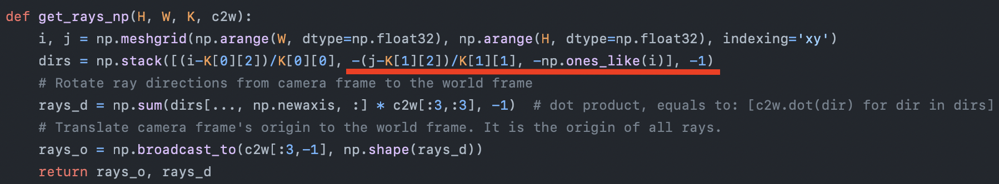
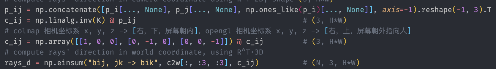
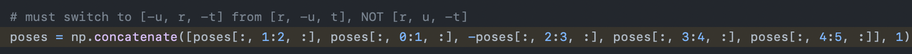
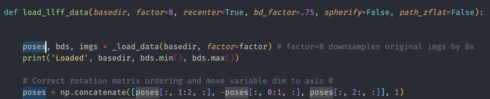
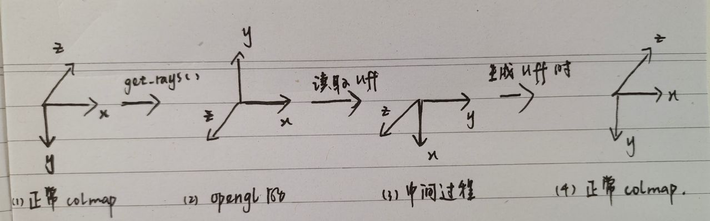

# 1 `get_rays()`

## 1.1 blender data

按照一般来说，不考虑 $z$ 的话，相机坐标系到图像坐标系转换是：
$$
\begin{pmatrix}u\\v\\1
\end{pmatrix}=
\begin{pmatrix}
f_x & 0 & c_x\\
0 & f_y & c_y\\
0 & 0 & 1
\end{pmatrix}
\begin{pmatrix}
x_c\\y_c\\1
\end{pmatrix}=K\cdot\begin{pmatrix}
x_c\\y_c\\1
\end{pmatrix}
$$
那也就是说，我现在想要把他原来的 loop 代码改成矩阵形式，我应该是直接进行下面的操作：
$$
\begin{pmatrix}
x_c\\y_c\\1
\end{pmatrix}=K^{-1}\cdot\begin{pmatrix}
u\\v\\1
\end{pmatrix}
$$
而这里算得的 $(x_c,\ y_c,\ 1)^T$ 不需要像代码中写的一样对 $y$ 轴和 $z$ 轴取反变成 $(x_c,-y_c,-1)^T$. 

我尝试过不对 $y,z$ 轴取反，然后训练的结果就是 30000+ 步的 psnr 还是一直是 8/9，也就是说无法训练，然后我还尝试了用 pre-train ckpt 只做 render，只不过修改了 `get_rays()`, 把其中的对 $y,z$ 取反给去掉了，然后 render 效果是一片空白。

最后是在 issue 里面找到说是，nerf 采用的相机坐标系是 opengl 约定方向，也就是 `[x, y, z] -> [r, u, -t]`，而我们在各种 cv 课上学的相机坐标系是和图像坐标系的方向一致，即 `[x, y, z] -> [r, -u, t]`，而他们提供的 blender data 的==**外参应该是从 opengl 相机坐标系到世界坐标系的转换**==。

所以最后如果想要用矩阵乘法来做的话，在做完 $K^{-1}\cdot(u,\ v,\ 1)^T$ 之后还需要乘一个坐标轴变换

## 1.2 llff data

如果说上面的 blender data 还好理解的话，这个 llff data 感觉就更离奇了一点，llff data 是用 colmap 稀疏重建之后读取并创建的数据，这个数据准备过程是在 https://github.com/Fyusion/LLFF/blob/master/llff/poses/pose_utils.py#L51 完成的，整体过程很好理解，就是先跑 colmap 跑完以后读取其中的 `cameras.bin, images.bin, pts3d.bin`，唯一奇怪的一点就是在读取相机外参即 `images.bin` 之后，他做了这样的操作：

他对旋转矩阵做了变换，在 https://github.com/Fyusion/LLFF/issues/10 这个 issue 里面作者说到这边他们采用的相机坐标系比较奇怪：

> From the point of view of the camera, the three axes are`[ down, right, backwards ]`

对应上面代码的数学形式即为：
$$
\text{colmap pose}\cdot\begin{pmatrix}
0 & 1 & 0\\
1 & 0 & 0\\
0 & 0 & -1\\
\end{pmatrix}
$$
上面是数据生成部分，下面是 nerf 代码中对生成的数据进行读取，这边又做了一次变换：

即在原始已经变换过的基础上又做了变换，数学表示就是：
$$
\text{colmap pose}\cdot\underbrace{\begin{pmatrix}
0 & 1 & 0\\
1 & 0 & 0\\
0 & 0 & -1\\
\end{pmatrix}}_{生成llff数据的时候做的}
\cdot\begin{pmatrix}
0 & -1 & 0\\
1 & 0 & 0\\
0 & 0 & 1\\
\end{pmatrix}
$$
最后就是到了 `get_rays()` 里面做的最后一次 $y,z$ 取反变换，整个数学表示为：
$$
\text{colmap pose}\cdot\underbrace{\begin{pmatrix}
0 & 1 & 0\\
1 & 0 & 0\\
0 & 0 & -1\\
\end{pmatrix}}_{生成llff数据的时候做的}
\cdot\underbrace{\begin{pmatrix}
0 & -1 & 0\\
1 & 0 & 0\\
0 & 0 & 1\\
\end{pmatrix}}_{nerf读取llff 的时候做的}\cdot\begin{pmatrix}
1 & 0 & 0\\
0 & -1 & 0\\
0 & 0 & -1\\
\end{pmatrix}
$$
用图表示一下整个坐标变换过程就是(对应上面矩阵从右到左的变换)：

也就是说绕了这么这一圈其实最后还是要回到基本的 cv 中默认的相机坐标系上来，这是必然的因为 colmap 生成的 `c2w` 外参是在这个坐标系下的。